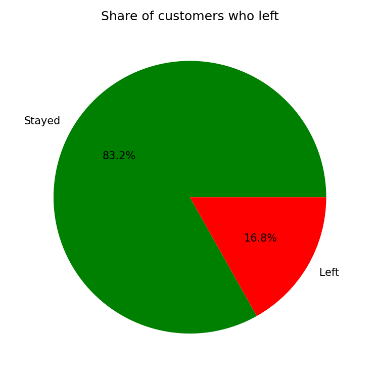
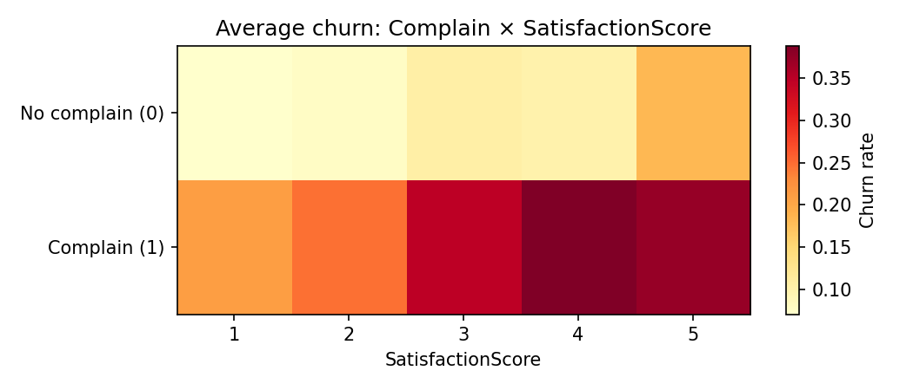
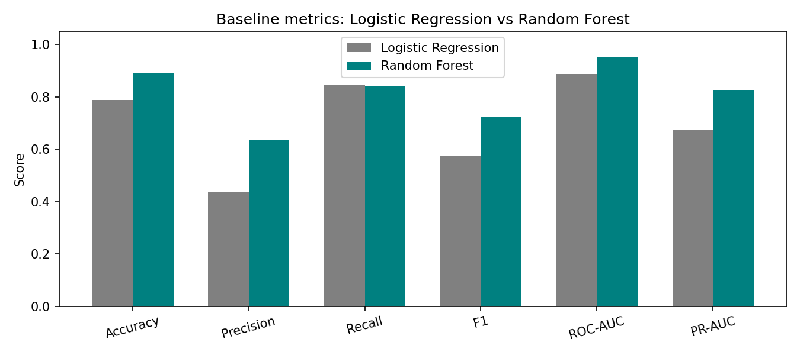
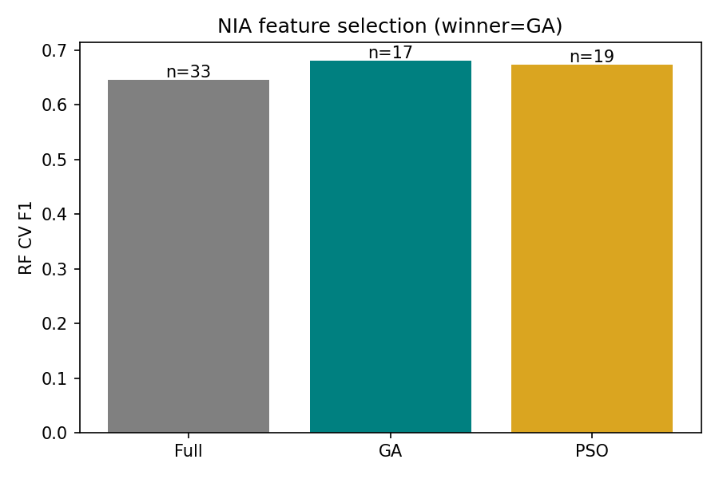
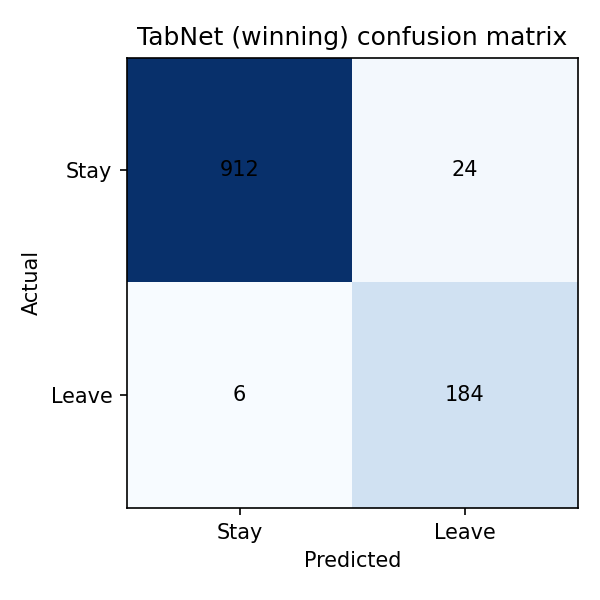
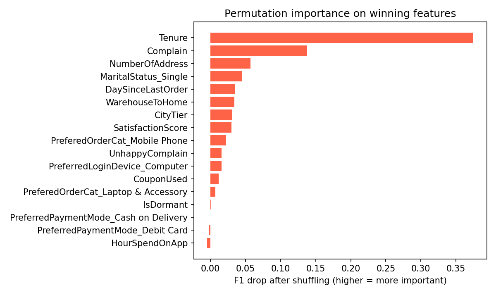
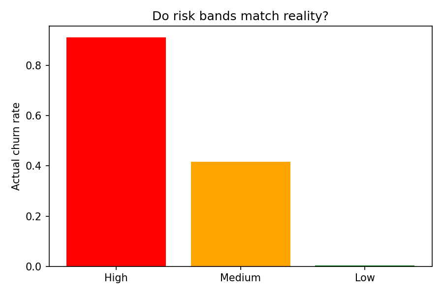
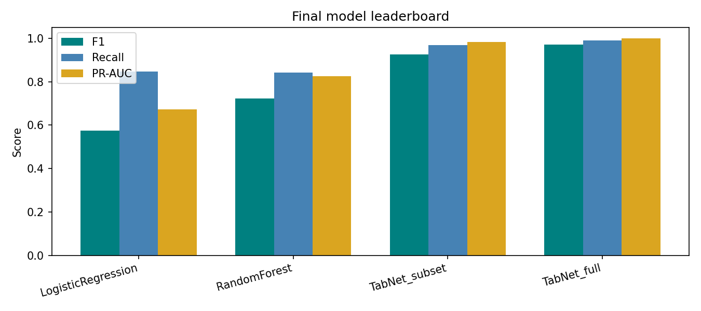

# E-commerce Customer Churn Prediction

Predict which online shoppers are likely to leave (**churn**), explain why, and
suggest retention actions.

This project uses beginner-friendly Jupyter notebooks with:

- clear data mining steps
- **Logistic Regression** and **Random Forest** baselines
- **Genetic Algorithm (GA)** and **Particle Swarm Optimization (PSO)** for feature selection
- **TabNet** as the final tabular neural predictor
- **Permutation importance** for explainability (instead of complex SHAP code)

Designed so a student with basic Python can explain every important line in a viva.

## Problem

Customer churn is expensive: keeping a customer usually costs less than winning a
new one. We treat churn as **binary classification** on behavioural and demographic
features. Because only ~17% of customers churn, we prioritise **Recall, F1, and
PR-AUC** over Accuracy.

## Project structure

```
ecommerce-customer-churn-prediction/
├── data/
│   ├── raw/              # Original Excel (place file here)
│   └── clean/            # Tables created by notebooks
├── figures/              # PNG charts (README gallery committed; rest via notebooks)
├── models/               # Saved LR, RF, TabNet
├── notebooks/            # Run 1 → 8 in order
├── environment.yml
├── requirements.txt
├── README.md
```

### Why each folder exists

| Path | Why it exists | If removed |
|------|---------------|------------|
| `data/raw/` | Holds the original dataset | Nothing to load |
| `data/clean/` | Shared inputs/outputs between notebooks | Pipeline breaks |
| `figures/` | Charts for the report/viva; a small README subset is committed, the rest is regenerated by notebooks | No visuals |
| `models/` | Saved fitted models | Cannot reuse TabNet/RF without re-training |
| `notebooks/` | The whole analysis | No project |

## Setup

### Conda (recommended)

```bash
conda env create -f environment.yml
conda activate ecommerce-churn
```

### Pip fallback

```bash
python -m venv .venv
# Windows: .venv\Scripts\activate
pip install -r requirements.txt
```

### Dataset

| Item | Detail |
|------|--------|
| Source | [Kaggle — E-commerce Customer Churn](https://www.kaggle.com/datasets/ankitverma2010/ecommerce-customer-churn-analysis-and-prediction) |
| Place file at | `data/raw/E_Commerce_Dataset.xlsx` |
| Sheets | `Data Dict`, `E Comm` |
| Size | ~5,630 customers × 20 columns |

Raw Excel is gitignored. Download it after cloning.

### Windows note

If PyTorch complains about OpenMP, run once in the terminal:

```bash
set KMP_DUPLICATE_LIB_OK=TRUE
```

## How to run

Open Jupyter from the project folder and run notebooks **in order**:

| # | Notebook | Purpose |
|---|----------|---------|
| 1 | `1_data_understanding.ipynb` | Problem, schema, missing values, churn balance |
| 2 | `2_data_exploration.ipynb` | EDA, associations, K-means segments |
| 3 | `3_data_preprocessing.ipynb` | Clean, encode, scale, train/test split |
| 4 | `4_baseline_models.ipynb` | Logistic Regression + Random Forest |
| 5 | `5_ga_feature_selection.ipynb` | Binary Genetic Algorithm (from scratch) |
| 6 | `6_pso_feature_selection.ipynb` | Binary PSO + GA vs PSO winner |
| 7 | `7_tabnet_model.ipynb` | TabNet on winning features |
| 8 | `8_prediction_and_insights.ipynb` | Permutation importance, risk bands, plays |

## Observed results (seed = 42, this machine)

| Stage | Result |
|-------|--------|
| Churn rate | ~16.8% |
| Baselines | RF stronger than LR (F1 ~0.72 vs ~0.58) |
| GA vs PSO | **GA wins** (17 features, RF CV F1 ~0.68) |
| TabNet (17 feats) | F1 ~0.92, Recall ~0.97 |
| Top drivers | Tenure, Complain (permutation importance) |
| High-risk band | Actual churn ~91% |

Exact numbers can vary slightly by hardware; re-run notebooks for your machine.

## Findings

### 1. Churn is rare, so accuracy is misleading



Only ~16.8% of customers churned. A model that predicts "nobody leaves" would still
score ~83% accuracy, which is why we judge everything on Recall, F1, and PR-AUC.

### 2. Complaints plus low satisfaction is the sharpest risk signal



The combination of a complaint and low satisfaction is worse than either alone.
That pattern motivates the `UnhappyComplain` feature built in notebook 3.

### 3. Random Forest clearly beats Logistic Regression



RF reaches F1 ~0.72 versus LR at ~0.58. Churn here is non-linear, so RF becomes
the workhorse for GA/PSO feature-selection fitness.

### 4. GA beat PSO and beat the full feature set



GA keeps 17 features at RF CV F1 ~0.68 and beats both PSO and the full feature
set — fewer features scored better than all of them.

### 5. TabNet catches almost every churner



TabNet on the winning subset reaches Recall ~0.97. Missing a churner is the
expensive error here, and TabNet rarely makes it.

### 6. Tenure and Complain are the dominant drivers



Shuffling Tenure or Complain causes the largest F1 drop. Short tenure and open
complaints are the clearest churn drivers in this dataset.

### 7. The high-risk band is genuinely high-risk



About ~91% of customers in the high-risk band actually churned, so the predicted
scores are usable for retention targeting.

### 8. Final leaderboard: TabNet on GA features wins



Across F1, Recall, and PR-AUC, TabNet trained on the GA feature subset leads the
board and is the model we recommend for scoring customers.

## Nature-inspired algorithms

- **GA (notebook 5):** binary chromosomes = feature masks; tournament selection, crossover, mutation, elitism. Fitness = stratified CV F1 − sparsity penalty.
- **PSO (notebook 6):** continuous positions → binary masks via sigmoid; pbest/gbest velocity updates; same fitness as GA.
- **TabNet (notebook 7):** attentive tabular neural net on the winning subset.

## License

See [LICENSE](LICENSE).
